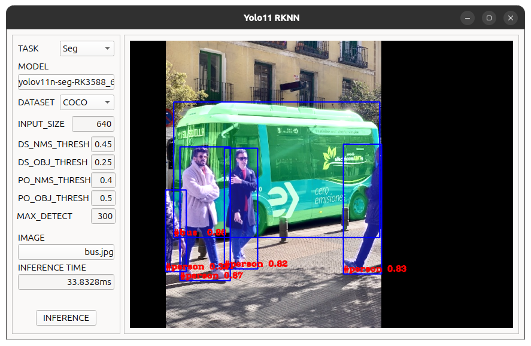
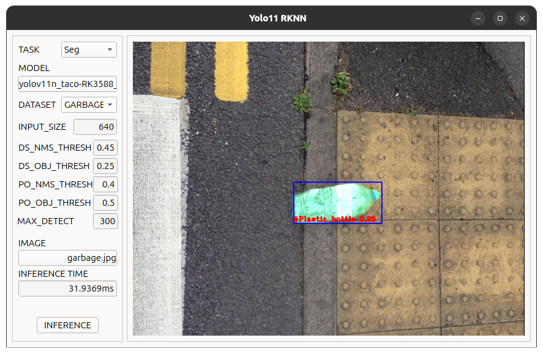

# Yolo11_rknn

DS : Detect and Seg

PO : Pose and OBB

MAX_DETECT : Seg 

### Requirement(요구사항)
```doc
python <= 3.12
ai-edge-litert==1.4.0
pyside6==6.10.0
conda-forge libstdcxx-n
rknn_toolkit_lite2-2.3.2
```

## 1. Detect

## 2. Pose

## 3. Seg

## 4. OBB
